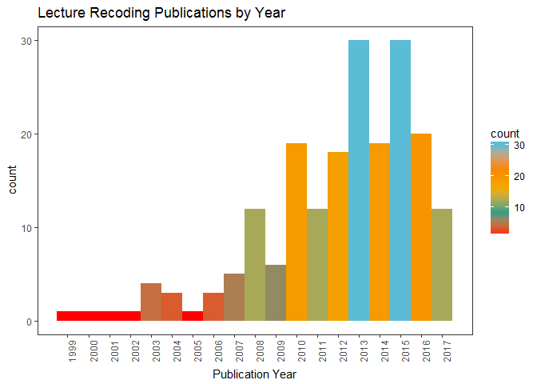
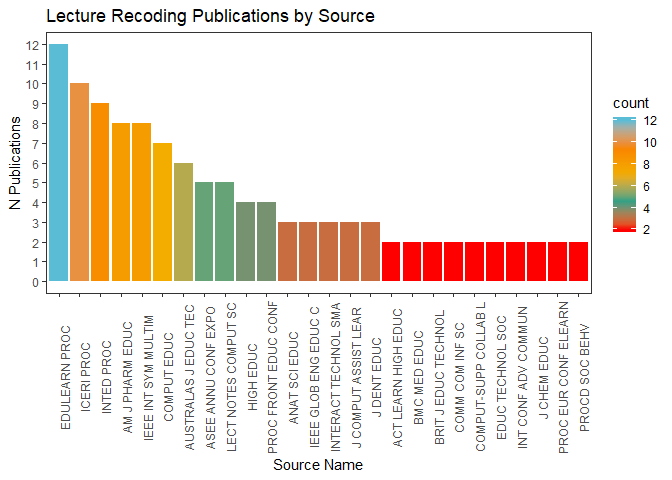
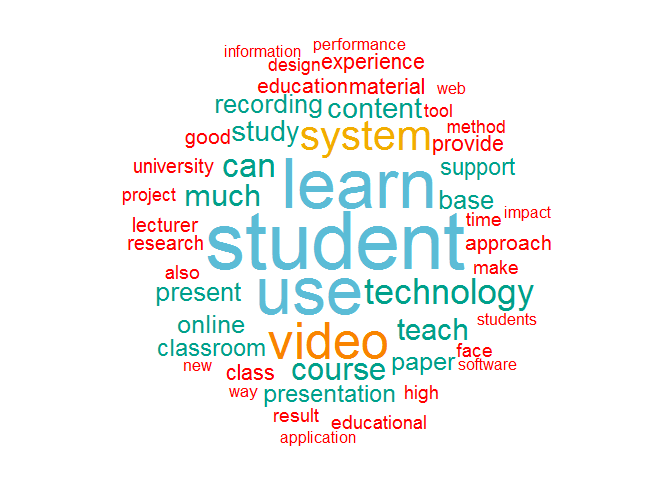

# About this Methodology
Trying to establish a repeatable (and therefore less time-dependent) methodology for quantitative summaries of literature review searches.

**Please note I am not implying that this is all a literature search is - I just want a repeatable methodology for the data processing part!**

## R Environment

```r
# Remember any packages you don't have can be installed with "install.packages("package.name")"
library(tidyverse)
```

```
## -- Attaching packages --------------------------------------------------------------------------------- tidyverse 1.2.1 --
```

```
## v ggplot2 2.2.1     v purrr   0.2.4
## v tibble  1.3.4     v dplyr   0.7.4
## v tidyr   0.7.2     v stringr 1.2.0
## v readr   1.1.1     v forcats 0.2.0
```

```
## -- Conflicts ------------------------------------------------------------------------------------ tidyverse_conflicts() --
## x dplyr::filter() masks stats::filter()
## x dplyr::lag()    masks stats::lag()
```

```r
library(stringr)
library(knitr)
library(tibble)
library(wesanderson)
library(tm)
```

```
## Loading required package: NLP
```

```
## 
## Attaching package: 'NLP'
```

```
## The following object is masked from 'package:ggplot2':
## 
##     annotate
```

```r
library(wordcloud)
```

```
## Loading required package: RColorBrewer
```

```r
library(textstem)
```

# Search Protocol
## Web of Science Search
Go to [Web of Science](https://webofknowledge.com/) and perform your search. In this case, we're searching for "lecture recording" OR "lecture capture" across all years. 

Once the search results have loaded go to the option at the top of the search results which, by default, reads `Save to EndNote online` and scroll down to `Save to other File Formats`. 

After clicking this, a pop up will ask you how many records you want to save, add the first and last record number in the `Records` box, and change `Record Content` to `Full Record`.

The `File Format` you want is `Tab-delimited (Windows UTF-8)`
Save this file. 

### Current Unsolved Problem
At some point I want to be able to read this file into R directly and manage it from there, but R is having real trouble reading the format of the file, even when it is UTF-8. 

Therefore, I have to open this file in Excel and save it as a .csv file. The file we're working with is therefore `lrec.csv`


# Data Management Protocol
## Reading in the Data

```r
LRecs <- read.csv("lrec.csv")
LRecs <- 
  LRecs %>%
  rename (Publication.Type = PT, 
          Authors = AU, 
          Book.Authors = BA, 
          Book.Editors = BE, 
          Book.Grp.Authors = GP, 
          Author.Full = AF, 
          Book.Author.Full = BF, 
          Group.Authors = CA, 
          Title = TI, 
          Publication.Name = SO, 
          Book.Series.Title = SE, 
          Book.Series.Subtitle = BS, 
          Language = LA, 
          Doc.Type = DT, 
          Conference.Title = CT, 
          Conference.Date = CY, 
          Conf.Location = CL, 
          Conf.Sponsors = SP, 
          Conf.Host = HO, 
          Keywords.Author = DE, 
          Keywords.Plus = ID, 
          Abstract = AB, 
          Author.Address = C1, 
          Reprint.Address = RP, 
          Contact.Email = EM, 
          ResearchID = RI, 
          OrcID = OI, 
          Funding.Agency = FU, 
          Funding.Text = FX, 
          Cited.Refs = CR, 
          Cited.Refs.Count = NR, 
          Times.Cited.Core = TC, 
          Times.Cited = Z9, 
          Usage.180Days = U1, 
          Usage.Since2013 = U2, 
          Publisher = PU, 
          Publisher.City = PI, 
          Publisher.Address = PA, 
          ISSN = SN, 
          eiSSN = EI, 
          ISBN = BN, 
          Source.Abbrev = J9, 
          ISO.Source.Abbrev = JI, 
          Date.Published = PD, 
          Year.Published = PY, 
          Volume = VL, 
          Issue = IS, 
          Part.Number = PN, 
          Supplement = SU, 
          Special.Issue = SI, 
          Meeting.Abstract = MA, 
          Pg.Start = BP, 
          Pg.End = EP,
          Article.Number = AR, 
          DOI = DI, 
          BkDOI = D2, 
          Page.Count = PG, 
          WoS.Cats = WC, 
          Res.Areas = SC, 
          Doc.Delivery.Number = GA, 
          Accession.Number = UT, 
          PubMedID = PM, 
          Open.Access.Journal = OA, 
          Highly.Cited = HC, 
          Hot.Paper = HP, 
          Date.Exported = DA) %>%
          select(-Contact.Email, -Author.Address, -Reprint.Address) 
#There's no need for us to have this contact info so the select function gets rid of them
```


# Exploring the Data
## Publications by Time

```r
ByYear <- ggplot (data = LRecs, aes(x = Year.Published, fill=..count..)) + 
  geom_histogram(binwidth = 1) + 
  labs (title = "Lecture Recoding Publications by Year", x = "Publication Year") + 
  theme_bw() + scale_fill_gradientn(colors = wes_palette("Darjeeling"))  + 
  theme(axis.text.x = element_text(angle = 90), panel.grid = element_blank()) + 
  scale_x_continuous(breaks = seq(1999,2017,1))
ByYear
```

<!-- -->

## Publications by Source

```r
by.pub <- 
          LRecs %>%
          filter(Source.Abbrev !="") %>%
          group_by(Source.Abbrev) 

by.pub <- within(by.pub, 
                   Source.Abbrev <- factor(Source.Abbrev, 
                                      levels=names(sort(table(Source.Abbrev), 
                                                        decreasing=TRUE))))

BySource <- ggplot (data = by.pub, aes(x = Source.Abbrev, fill=..count..)) + 
  geom_bar() + 
  labs (title = "Lecture Recoding Publications by Source", x = "Source Name", y = "N Publications") + 
  theme_bw() + scale_fill_gradientn(colors = wes_palette("Darjeeling"))  + 
  theme(axis.text.x = element_text(angle = 90), panel.grid = element_blank()) +
  scale_y_continuous(breaks = seq(0,13,1))
BySource
```

<!-- -->

### Current Unsolved Problem
Can/Should we get rid of the journals with one publication?


## Visualise Abstracts
Visualise roughly what is being said in the abstracts of these papers.

```r
LRecs$LemAbstracts <- lemmatize_strings(LRecs$Abstract)
Abstract.corpus <- Corpus(VectorSource(LRecs$LemAbstracts)) %>%
     tm_map(removePunctuation) %>%
     tm_map(removeNumbers) %>%
     tm_map(tolower)  %>%
     tm_map(removeWords, stopwords("english")) %>%
     tm_map(removeWords, c("lecture", "record", "capture")) %>%
     tm_map(stripWhitespace)

Abstract.dtm <- DocumentTermMatrix(Abstract.corpus)
inspect(Abstract.dtm)
```

```
## <<DocumentTermMatrix (documents: 198, terms: 2104)>>
## Non-/sparse entries: 8110/408482
## Sparsity           : 98%
## Maximal term length: 16
## Weighting          : term frequency (tf)
## Sample             :
##      Terms
## Docs  can course learn much student system teach technology use video
##   103   2      1    14    2      13      0     2          2   1     0
##   104   1      0     5    4       2      1     1          1   3     2
##   118   4      1     5    1      11      0     0          7   6     1
##   137   1      0     4    0       6      0     0          0   5     3
##   179   2      0     3    2       0      2     0          1   0     1
##   23    9      0    18    4       5      3     0          4   1     3
##   26    0      0     6    0       3      1     6          0   5     0
##   50    2      0     2    2       5      0     1          1   4    17
##   75    0      9     2    1       2      0     2          0   3     0
##   94    6      3     0    1       7      0     0          0   8     0
```

```r
findFreqTerms(Abstract.dtm, 20)
```

```
##  [1] "academic"     "access"       "base"         "course"      
##  [5] "group"        "high"         "impact"       "increase"    
##  [9] "live"         "method"       "much"         "provide"     
## [13] "question"     "recording"    "result"       "student"     
## [17] "study"        "teacher"      "time"         "use"         
## [21] "video"        "view"         "year"         "approach"    
## [25] "content"      "create"       "describe"     "education"   
## [29] "environment"  "finding"      "learn"        "many"        
## [33] "model"        "practice"     "project"      "show"        
## [37] "teach"        "technology"   "university"   "value"       
## [41] "work"         "class"        "effect"       "good"        
## [45] "include"      "material"     "online"       "performance" 
## [49] "present"      "presentation" "slide"        "students"    
## [53] "three"        "lecturer"     "research"     "application" 
## [57] "can"          "effective"    "enhance"      "face"        
## [61] "however"      "improve"      "survey"       "traditional" 
## [65] "two"          "experience"   "new"          "paper"       
## [69] "allow"        "also"         "classroom"    "design"      
## [73] "develop"      "development"  "process"      "software"    
## [77] "support"      "system"       "tool"         "available"   
## [81] "different"    "make"         "need"         "one"         
## [85] "web"          "activity"     "audio"        "delivery"    
## [89] "educational"  "type"         "faculty"      "information" 
## [93] "offer"        "format"       "way"          "digital"     
## [97] "user"         "camera"       "multimedia"
```

```r
Abstract.Wordle <- wordcloud(Abstract.corpus, scale = c(5,0.5), max.words = 100, random.order = FALSE, random.color = FALSE, rot.per = 0, use.r.layout = FALSE, colors = wes_palette("Darjeeling"))
```

<!-- -->

### Current To-Do 
Make Document Term Matrix
