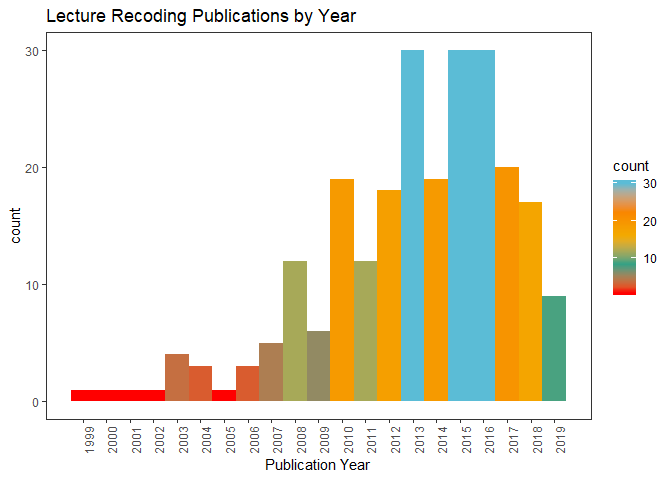

# About this Methodology
Trying to establish a repeatable (and therefore less time-dependent) methodology for quantitative summaries of literature review searches.

**Please note I am not implying that this is all a literature search is - I just want a repeatable methodology for the data processing part!**

## R Environment

```r
# Remember any packages you don't have can be installed with "install.packages("package.name")"

library(tidyverse)
```

```
## -- Attaching packages ------------------------------------------- tidyverse 1.2.1 --
```

```
## v ggplot2 3.2.0     v purrr   0.3.2
## v tibble  2.1.3     v dplyr   0.8.1
## v tidyr   0.8.3     v stringr 1.4.0
## v readr   1.3.1     v forcats 0.4.0
```

```
## -- Conflicts ---------------------------------------------- tidyverse_conflicts() --
## x dplyr::filter() masks stats::filter()
## x dplyr::lag()    masks stats::lag()
```

```r
library(knitr)
library(tidytext)
library(wordcloud)
```

```
## Warning: package 'wordcloud' was built under R version 3.6.1
```

```
## Loading required package: RColorBrewer
```

```r
library(textstem)
```

```
## Loading required package: koRpus.lang.en
```

```
## Loading required package: koRpus
```

```
## Loading required package: sylly
```

```
## For information on available language packages for 'koRpus', run
## 
##   available.koRpus.lang()
## 
## and see ?install.koRpus.lang()
```

```
## 
## Attaching package: 'koRpus'
```

```
## The following object is masked from 'package:readr':
## 
##     tokenize
```

```r
# I'm using some nice palette packages for the chart 
# This is entirely up to you

library(wesanderson)
```

# Search Protocol
## Web of Science Search
Go to [Web of Science](https://webofknowledge.com/) and perform your search. In this case, we're searching for **"lecture recording" OR "lecture capture"** across all years. 

Once the search results have loaded: Go to 'export' at the bottom of the page. By default this goes to `Save to EndNote online` so scroll down to `Save to other File Formats`. 

After clicking this, a pop up will ask you how many records you want to save, add the first and last record number in the `Records` box, and change `Record Content` to `Full Record`.

The `File Format` you want is `Tab-delimited (Windows UTF-8)`
Save this file. 

### Please Note
To keep this data upload as sensible as possible I've edited this file to delete the email addresses and reprint addresses. However your process will remain the same. 


# Data Management Protocol
## Reading in the Data

```r
LRecs <- 
  readr::read_tsv("data/savedrecs.txt") %>% 
  rename (Publication.Type = PT, 
          Authors = AU, 
          Book.Authors = BA, 
          Book.Editors = BE, 
          Book.Grp.Authors = GP, 
          Author.Full = AF, 
          Book.Author.Full = BF, 
          Group.Authors = CA, 
          Title = TI, 
          Publication.Name = SO, 
          Book.Series.Title = SE, 
          Book.Series.Subtitle = BS, 
          Language = LA, 
          Doc.Type = DT, 
          Conference.Title = CT, 
          Conference.Date = CY, 
          Conf.Location = CL, 
          Conf.Sponsors = SP, 
          Conf.Host = HO, 
          Keywords.Author = DE, 
          Keywords.Plus = ID, 
          Abstract = AB, 
          Author.Address = C1, 
          Reprint.Address = RP, 
          Contact.Email = EM, 
          ResearchID = RI, 
          OrcID = OI, 
          Funding.Agency = FU, 
          Funding.Text = FX, 
          Cited.Refs = CR, 
          Cited.Refs.Count = NR, 
          Times.Cited.Core = TC, 
          Times.Cited = Z9, 
          Usage.180Days = U1, 
          Usage.Since2013 = U2, 
          Publisher = PU, 
          Publisher.City = PI, 
          Publisher.Address = PA, 
          ISSN = SN, 
          eiSSN = EI, 
          ISBN = BN, 
          Source.Abbrev = J9, 
          ISO.Source.Abbrev = JI, 
          Date.Published = PD, 
          Year.Published = PY, 
          Volume = VL, 
          Issue = IS, 
          Part.Number = PN, 
          Supplement = SU, 
          Special.Issue = SI, 
          Meeting.Abstract = MA, 
          Pg.Start = BP, 
          Pg.End = EP,
          Article.Number = AR, 
          DOI = DI, 
          BkDOI = D2, 
          Page.Count = PG, 
          WoS.Cats = WC, 
          Res.Areas = SC, 
          Doc.Delivery.Number = GA, 
          Accession.Number = UT, 
          PubMedID = PM, 
          Open.Access.Journal = OA, 
          Highly.Cited = HC, 
          Hot.Paper = HP, 
          Date.Exported = DA) %>%
  select(-Contact.Email, -Author.Address, -Reprint.Address) 
```

```
## Parsed with column specification:
## cols(
##   .default = col_character(),
##   CA = col_logical(),
##   BS = col_logical(),
##   CR = col_logical(),
##   NR = col_double(),
##   TC = col_double(),
##   Z9 = col_double(),
##   U1 = col_double(),
##   U2 = col_double(),
##   PY = col_double(),
##   VL = col_double(),
##   IS = col_double(),
##   MA = col_double(),
##   EA = col_logical(),
##   EY = col_logical(),
##   PG = col_double(),
##   PM = col_double(),
##   HC = col_logical(),
##   HP = col_logical()
## )
```

```
## See spec(...) for full column specifications.
```

```r
#There's no need for us to have this contact info so the select function gets rid of them
```


# Exploring the Data
## Publications by Time

```r
ByYear <- 
  LRecs %>% 
  ggplot (aes(x = Year.Published, fill=..count..)) + 
  geom_histogram(binwidth = 1) + 
  labs (title = "Lecture Recoding Publications by Year", 
        x = "Publication Year") + 
  theme_bw() + 
  scale_fill_gradientn(colors = wes_palette("Darjeeling1"))  + 
  theme(axis.text.x = element_text(angle = 90), panel.grid = element_blank()) + 
  scale_x_continuous(breaks = seq(1999, 2019, 1))

ByYear
```

<!-- -->

## Publications by Source

```r
by.pub <- 
          LRecs %>%
          filter(Source.Abbrev !="") %>%
          group_by(Source.Abbrev) 

by.pub <- within(by.pub, 
                   Source.Abbrev <- factor(Source.Abbrev, 
                                      levels=names(sort(table(Source.Abbrev), 
                                                        decreasing=TRUE))))

BySource <-
  by.pub %>% 
  group_by(Source.Abbrev) %>% 
  summarise(count = n()) %>%  
  filter(count > 1) %>% 
  ggplot(aes (x = Source.Abbrev, y = count, fill = count)) +
  geom_bar(stat = "identity") +
  labs (title = "Lecture Recoding Publications by Source", 
        x = "Source Name", 
        y = "N Publications") + 
  theme_bw() + 
  scale_fill_gradientn(colors = wes_palette("Darjeeling1"))  + 
  theme(axis.text.x = element_text(angle = 90), 
        panel.grid = element_blank()) +
  scale_y_continuous(breaks = seq(0,15,1))

BySource
```

<!-- -->


## Visualise Abstracts
Visualise roughly what is being said in the abstracts of these papers.

```r
mystops <- tibble(word = c("lecture", "record", "capture"),
                  lexicon = c("my", "my", "my")) 

mystops <- rbind(mystops, stop_words)

tidy_abstracts <- 
  LRecs %>% 
  unnest_tokens(word, Abstract, token = "words") %>% 
  mutate(word = lemmatize_strings(word)) %>% 
  anti_join(mystops) 
```

```
## Joining, by = "word"
```

```r
tidy_abstracts %>% 
  count(word) %>% 
  with(wordcloud(words = word, 
                 freq = n, 
                 random.order = FALSE, 
                 max.words = 100,
                 random.color = FALSE, 
                 rot.per = 0, 
                 use.r.layout = FALSE, 
                 colors = wes_palette("Royal1")))
```

<!-- -->
